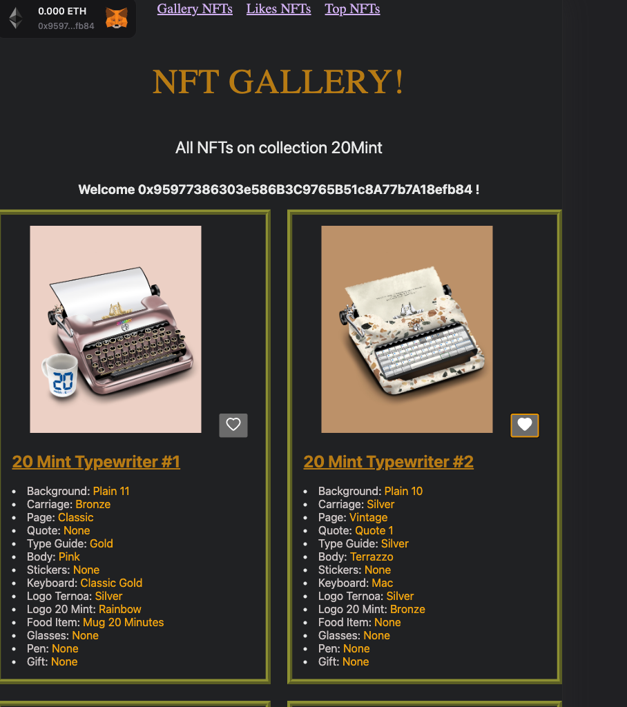

# Gallery NFTs

A responsive website for an NFT gallery where you can like an NFT on the 20mint collection, view the addresses that have liked the NFT, and see the most popular NFT liked. The like system is save locally and persistent with localStorage.


## Install

```bash
git clone https://github.com/jecombe/gallery-nft.git && cd gallery-nft
npm i
npm run dev
```
Go to navigator with url http://localhost:3000


## Describe

### Gallery NFTs
  

 ```diff
- In order to like the content, you need to connect your wallet and sign the message.  
```  
  

### Likes NFTs
  
This page allows you to view the NFTs that have received likes.  

### Top NFT
  
Here you can see the NFT that has received the most likes.  

## How is built ?

* [Next.js](https://nextjs.org/) - React Framework
* [ThirdWeb](https://thirdweb.com/) - Web3 Framework
* [Typescript](https://www.typescriptlang.org/) - Typed Language

## Auteurs
* **Jérémy Combe** _alias_ [@jecombe](https://github.com/jecombe)
